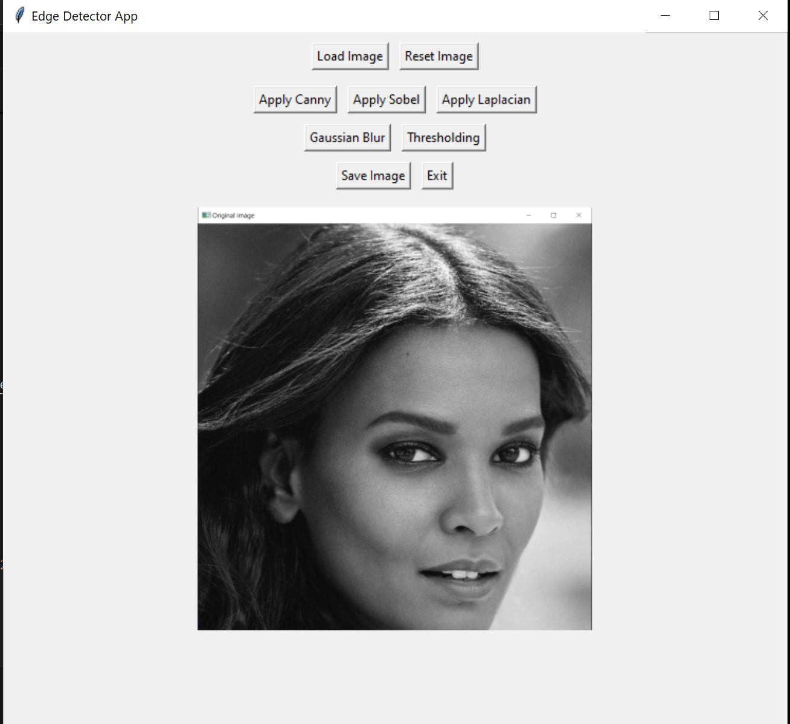
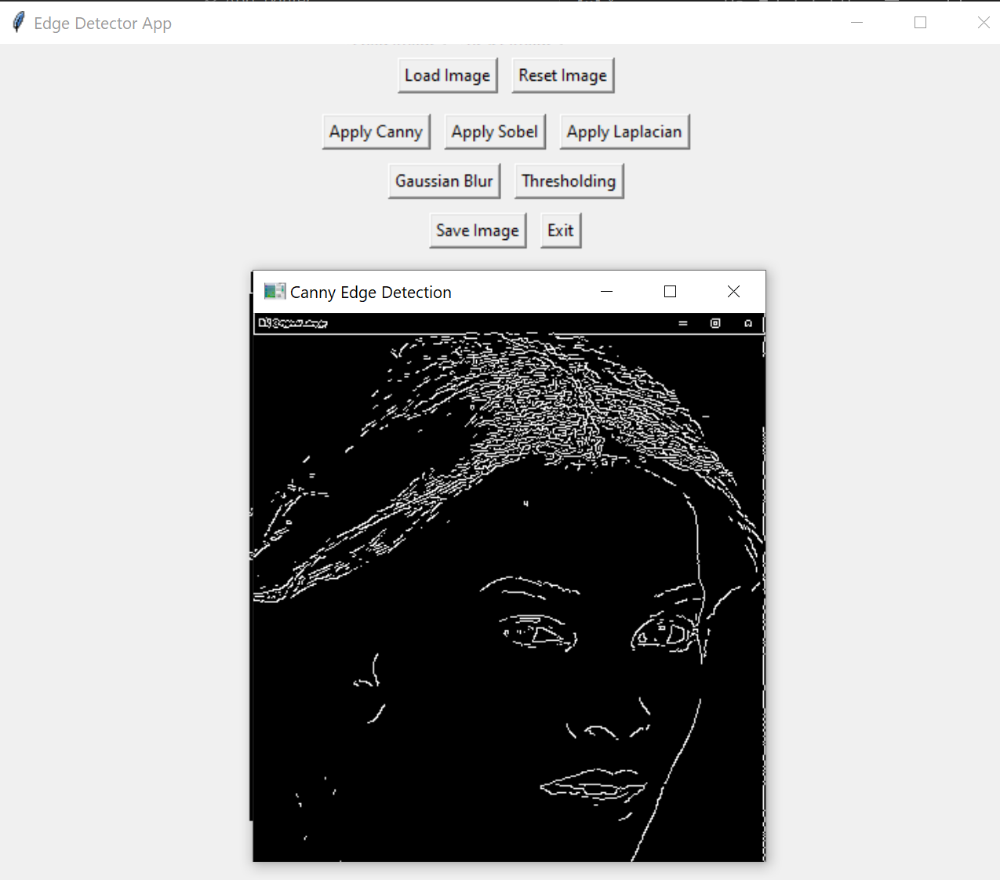
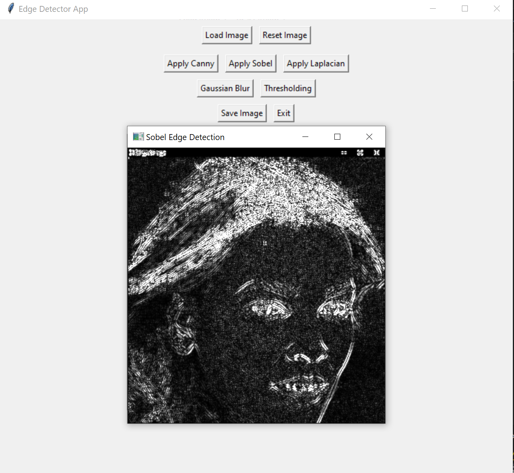
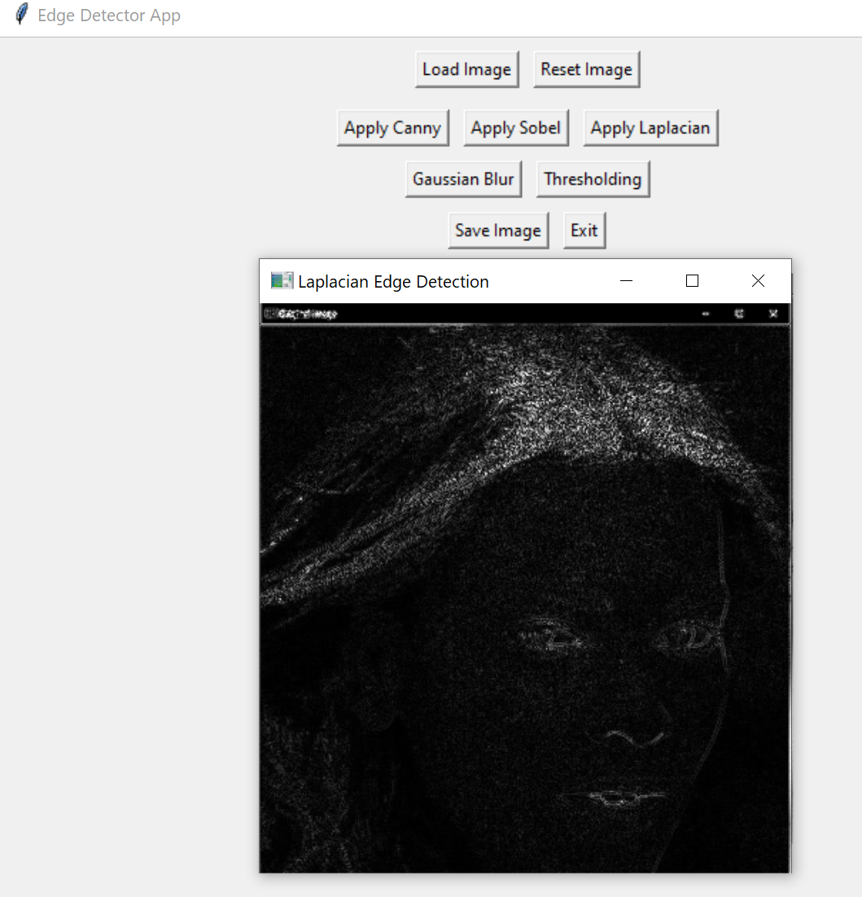

#  Edge Detector App

A beginner-friendly GUI application to perform **edge detection and image processing** using Python's `OpenCV`, `PIL`, and `Tkinter`.   
This tool helps visualize and apply common edge detection techniques with ease, making it perfect for learners and developers experimenting with computer vision.

---

##  Features

✅ Load and display any image (JPG, PNG, JPEG)  
✅ Apply edge detection techniques:
- Canny
- Sobel
- Laplacian

✅ Apply image processing methods:
- Gaussian Blur
- Thresholding

✅ Reset to original image  
✅ Save processed image  
✅ Clean and responsive Tkinter GUI  

---

##  Technologies Used

- Python 3.12+
- OpenCV (`cv2`)
- PIL (`Pillow`)
- Tkinter

---

## 📸 Demo

| Original | Canny | Sobel | Laplacian |
|----------|-------|-------|-----------|
|  |  |  |  |


---

## 🧠 How It Works

- **Image Loading**: Reads image and resizes it for display.
- **Edge Detection**: Converts image to grayscale and applies filters using `cv2`:
  - `cv2.Canny()`
  - `cv2.Sobel()`
  - `cv2.Laplacian()`
- **Preprocessing**: Optionally applies Gaussian blur or thresholding.
- **Tkinter GUI**: A structured UI for interaction and previewing results.

---

##  Getting Started

### 1. Clone the repository

```bash
git clone https://github.com/yourusername/Edge-Detector-App.git
cd Edge-Detector-App
